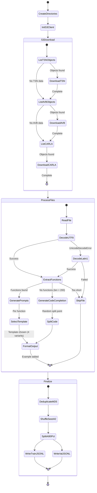
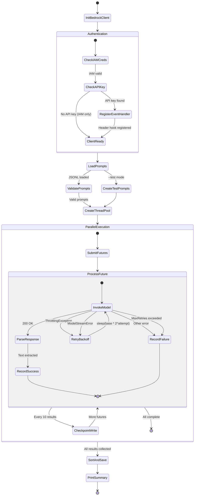
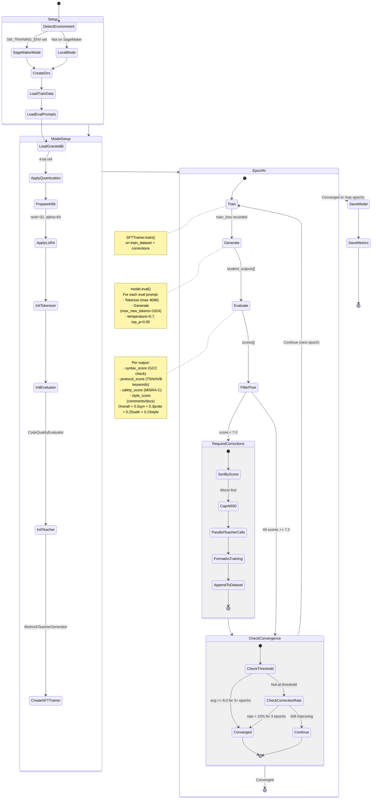
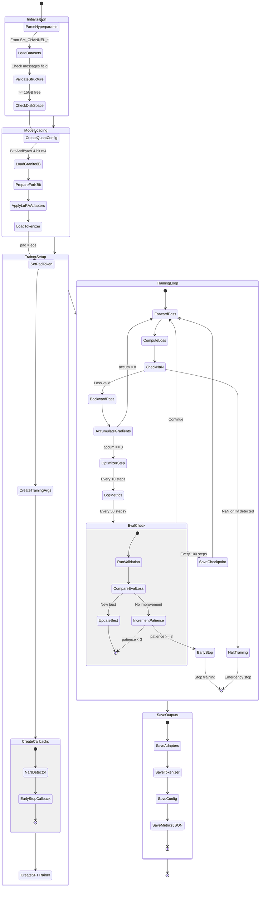
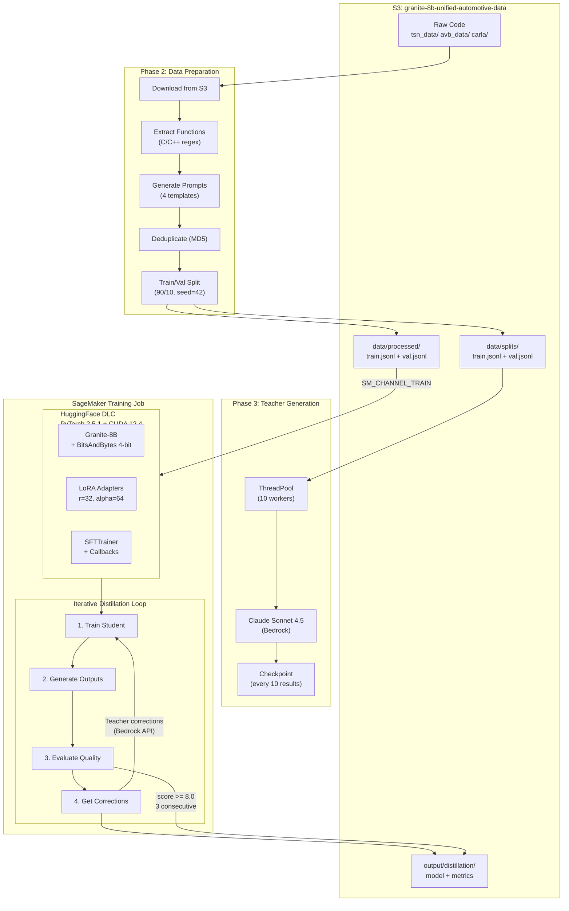
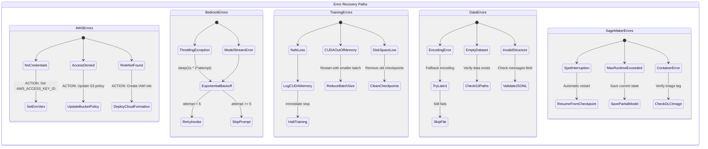
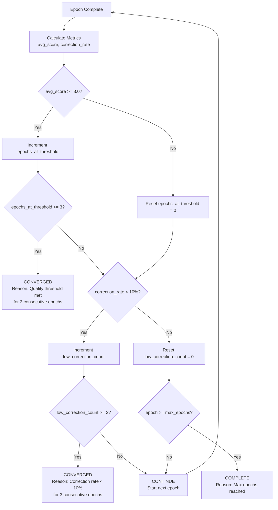
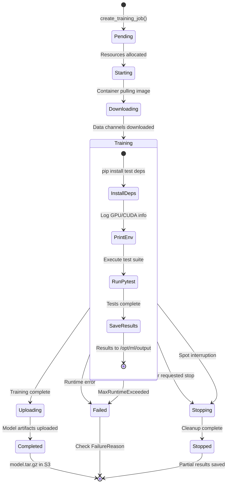

# Granite-8B Training Pipeline - State Machine Diagram

## 1. Top-Level Pipeline State Machine

```mermaid
stateDiagram-v2
    [*] --> Validation
    Validation --> DataPreparation : All checks pass
    Validation --> [*] : Validation failed

    DataPreparation --> TeacherGeneration : train.jsonl + val.jsonl ready
    DataPreparation --> [*] : No data extracted

    TeacherGeneration --> TrainingLaunch : Teacher outputs generated
    TeacherGeneration --> TrainingLaunch : Skip (use raw data only)

    TrainingLaunch --> IterativeDistillation : SageMaker job running
    TrainingLaunch --> [*] : Launch failed

    IterativeDistillation --> Complete : Converged or max epochs
    IterativeDistillation --> [*] : Fatal error

    Complete --> [*] : Model saved to S3

    state Validation {
        [*] --> AWSCredentials
        AWSCredentials --> S3Access : Valid
        AWSCredentials --> ValidationError : Invalid
        S3Access --> BedrockAuth : Bucket accessible
        S3Access --> ValidationError : Access denied
        BedrockAuth --> IAMRole : Model responds
        BedrockAuth --> ValidationWarn : --skip-bedrock
        IAMRole --> HFToken : Role exists
        IAMRole --> ValidationError : Role missing
        HFToken --> ConfigCheck : Token valid
        HFToken --> ValidationWarn : Token missing
        ConfigCheck --> LocalFiles : YAML valid
        ConfigCheck --> ValidationError : Invalid config
        LocalFiles --> ScriptSyntax : Files exist
        ScriptSyntax --> ImportCheck : Valid Python
        ImportCheck --> [*] : All imports resolve
        ValidationError --> [*]
        ValidationWarn --> ConfigCheck
    }

    state DataPreparation {
        [*] --> InitDirs
        InitDirs --> S3Download
        S3Download --> TSNProcess : TSN files downloaded
        TSNProcess --> AVBProcess : Functions extracted
        AVBProcess --> CARLAProcess : AVB data processed
        CARLAProcess --> Deduplication : CARLA data processed
        Deduplication --> TrainValSplit : Duplicates removed
        TrainValSplit --> SaveSplits : 90/10 split
        SaveSplits --> [*] : JSONL files saved
    }

    state TeacherGeneration {
        [*] --> InitBedrock
        InitBedrock --> LoadPrompts : Client ready
        LoadPrompts --> ParallelGenerate : Prompts loaded
        ParallelGenerate --> CheckpointSave : Batch complete
        CheckpointSave --> ParallelGenerate : More prompts
        CheckpointSave --> [*] : All done
    }

    state IterativeDistillation {
        [*] --> LoadModel
        LoadModel --> EpochLoop : Granite-8B + QLoRA ready

        state EpochLoop {
            [*] --> TrainStep
            TrainStep --> GenerateOutputs : Loss computed
            GenerateOutputs --> EvaluateQuality : Student outputs ready
            EvaluateQuality --> IdentifyPoor : Scores calculated
            IdentifyPoor --> GetCorrections : Poor outputs found
            IdentifyPoor --> ConvergenceCheck : No poor outputs
            GetCorrections --> AddToDataset : Teacher corrections received
            AddToDataset --> ConvergenceCheck : Dataset updated
            ConvergenceCheck --> [*] : Converged
            ConvergenceCheck --> TrainStep : Not converged
        }

        EpochLoop --> SaveFinalModel : Loop complete
        SaveFinalModel --> [*]
    }
```

## 2. Data Preparation Detail

## 3. Teacher Output Generation Detail

## 4. Iterative Distillation Epoch Loop

## 5. QLoRA Training Loop (SageMaker)

## 6. Quality Scoring State Machine

```mermaid
stateDiagram-v2
    [*] --> ExtractCode

    state ExtractCode {
        [*] --> CheckMarkdown
        CheckMarkdown --> ParseCodeBlocks : Has ``` blocks
        CheckMarkdown --> UseRawText : No markdown
        ParseCodeBlocks --> [*]
        UseRawText --> [*]
    }

    ExtractCode --> SyntaxCheck

    state SyntaxCheck {
        [*] --> TryGCC
        TryGCC --> GCCCompile : GCC available
        TryGCC --> HeuristicCheck : GCC not found

        GCCCompile --> Score10 : Clean compile
        GCCCompile --> Score7to9 : Warnings only
        GCCCompile --> Score5to6 : Errors present
        GCCCompile --> Score0 : Multiple critical errors

        HeuristicCheck --> CheckBraces
        CheckBraces --> CheckParens
        CheckParens --> CheckSemicolons
        CheckSemicolons --> [*] : Base 7.0 +/- penalties
    }

    SyntaxCheck --> ProtocolCheck

    state ProtocolCheck {
        [*] --> DetectDomain
        DetectDomain --> CheckTSNKeywords : TSN prompt
        DetectDomain --> CheckAVBKeywords : AVB prompt
        DetectDomain --> GenericScore : Unknown domain

        CheckTSNKeywords --> CountMatches : pcp, vlan, timestamp, gate, priority, qbv, qav, shaper, gcl, schedule
        CheckAVBKeywords --> CountMatches : stream, sample, channel, bandwidth, srp, talker, listener, reservation

        CountMatches --> ApplyPenalties : < 3 keywords found
        CountMatches --> [*] : >= 3 keywords found
        ApplyPenalties --> [*] : -1.5 per missing keyword

        GenericScore --> [*] : Default 6.0
    }

    ProtocolCheck --> SafetyCheck

    state SafetyCheck {
        [*] --> CheckViolations
        CheckViolations --> GotoCheck : -3.0
        CheckViolations --> MallocCheck : -2.0 each
        CheckViolations --> SetjmpCheck : -3.0
        CheckViolations --> AbortCheck : -1.5

        GotoCheck --> CheckGoodPractices
        MallocCheck --> CheckGoodPractices
        SetjmpCheck --> CheckGoodPractices
        AbortCheck --> CheckGoodPractices

        CheckGoodPractices --> FixedWidthTypes : +0.5 each
        FixedWidthTypes --> StaticConst : +0.3 each
        StaticConst --> Volatile : +0.2

        Volatile --> CheckRecursion : -1.5 if found
        CheckRecursion --> CheckInfiniteLoops : -2.0 if while(1) no break
        CheckInfiniteLoops --> [*] : Clamped [0, 10]
    }

    SafetyCheck --> StyleCheck

    state StyleCheck {
        [*] --> CountComments
        CountComments --> Score8 : 5+ comments
        CountComments --> Score7 : 2-5 comments
        CountComments --> Score5 : 0 comments

        Score8 --> CheckDoxygen
        Score7 --> CheckDoxygen
        Score5 --> CheckDoxygen

        CheckDoxygen --> CheckVarNames : +0.5 to +2.0
        CheckVarNames --> CheckIndentation : -1.0 if >5 single-letter
        CheckIndentation --> [*] : -0.5 if mixed tabs/spaces
    }

    StyleCheck --> ComputeOverall

    state ComputeOverall {
        [*] --> WeightedAverage
        note right of WeightedAverage
            overall = 0.30 * syntax
                    + 0.30 * protocol
                    + 0.25 * safety
                    + 0.15 * style
        end note
        WeightedAverage --> NeedsCorrection : overall < 7.0
        WeightedAverage --> Acceptable : overall >= 7.0
    }

    ComputeOverall --> [*]
```

## 7. Data Flow Diagram

## 8. Error Recovery State Machine

## 9. Convergence Decision Logic

## 10. SageMaker Job Lifecycle

## Summary of States by Phase

| Phase | Script | States | Decision Points | Error States |
|-------|--------|--------|-----------------|--------------|
| Validation | dry_run_pipeline.py | 9 | 9 | 6 |
| Data Prep | prepare_automotive_data.py | 10 | 4 | 4 |
| Teacher Gen | generate_teacher_outputs.py | 7 | 3 | 5 |
| Training Launch | run_training_job.py | 8 | 2 | 4 |
| Iterative Distillation | iterative_distillation.py | 12 | 3 | 5 |
| QLoRA Training | train_granite_qlora.py | 14 | 4 | 7 |
| Cloud Launch | launch_cloud_training.py | 9 | 2 | 4 |
| **Total** | **7 scripts** | **69 states** | **27 decision points** | **35 error states** |
