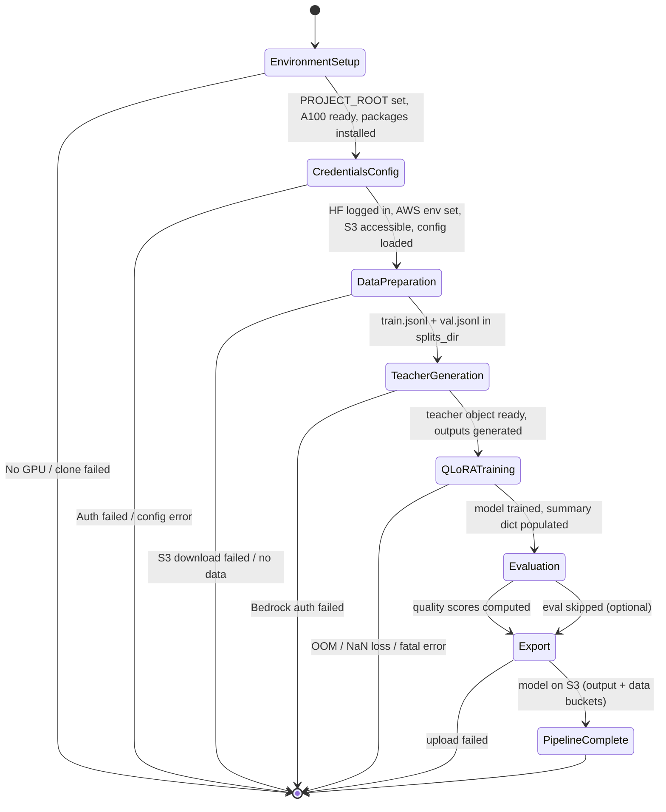
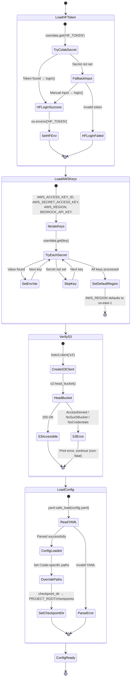
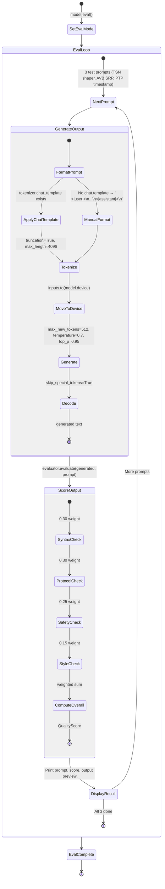

# Colab Notebook Pipeline - State Machine Diagrams

> Each section of `training.ipynb` has its own state machine diagram.
> Entry/exit conditions are consistent across sections — the postconditions of Section N match the preconditions of Section N+1.

---

## 0. Top-Level Orchestrator

### Cross-Section Contract Table

| Transition | Postconditions (producer) | Preconditions (consumer) |
|---|---|---|
| Env → Creds | `PROJECT_ROOT`, `sys.path`, GPU confirmed, packages installed, `OUTPUT_BUCKET` set | `os`, `torch`, `boto3` importable, `PROJECT_ROOT` exists |
| Creds → Data | `HF_TOKEN` in env, AWS keys in env, S3 bucket verified, `config` dict | `config['aws']['s3']`, `os.environ['AWS_REGION']` |
| Data → Teacher | `splits_dir` has `train.jsonl` + `val.jsonl`, `train_examples`, `val_examples` | `config['distillation']`, AWS creds in env |
| Teacher → QLoRA | `teacher` object (BedrockTeacherGenerator), teacher outputs saved | `train_dataset`, `val_dataset`, `teacher`, `config`, GPU available |
| QLoRA → Eval | `model` (trained PeftModel), `tokenizer`, `evaluator`, `summary` dict | `model`, `tokenizer`, `evaluator` |
| Eval → Export | Quality scores displayed (informational only) | `model`, `tokenizer`, `summary`, `model_output_dir`, `OUTPUT_BUCKET`, AWS creds |

---

## 1. Environment Setup (cells 0–5)

```mermaid
stateDiagram-v2
    [*] --> InstallDeps

    state InstallDeps {
        [*] --> PipInstall : pip install -q (13 packages)
        PipInstall --> DepsReady : All installed
        PipInstall --> DepsFailed : Version conflict / network error
        DepsReady --> [*]
        DepsFailed --> [*]
    }

    InstallDeps --> ProjectSetup

    state ProjectSetup {
        [*] --> SetS3Config : OUTPUT_BUCKET, S3_OUTPUT_PREFIX
        SetS3Config --> GetGitHubToken : userdata.get('GITHUB_TOKEN')
        GetGitHubToken --> CloneRepo
    }

    state CloneRepo {
        [*] --> CheckExists
        CheckExists --> AlreadyCloned : PROJECT_ROOT exists
        CheckExists --> GitClone : Not found
        GitClone --> CloneSuccess : git clone OK (private repo with token)
        GitClone --> CloneFailed : Network error / bad token
        AlreadyCloned --> [*]
        CloneSuccess --> [*]
        CloneFailed --> [*]
    }

    CloneRepo --> SetupPaths

    state SetupPaths {
        [*] --> Chdir : os.chdir(PROJECT_ROOT)
        Chdir --> InsertSysPath : sys.path.insert(0, PROJECT_ROOT)
        InsertSysPath --> CreateDataDirs : makedirs data/raw, data/processed, etc.
        CreateDataDirs --> [*]
    }

    SetupPaths --> AllImports

    state AllImports {
        [*] --> StdLib : gc, json, os, shutil, sys, Path
        StdLib --> ColabImports : userdata
        ColabImports --> MLImports : torch, yaml
        MLImports --> HFImports : transformers, peft, trl, datasets
        HFImports --> AWSImports : boto3
        AWSImports --> ProjectImports : evaluation, training, scripts
        ProjectImports --> ImportsReady : All imports successful
        ProjectImports --> ImportFailed : Module not found (sys.path issue)
        ImportsReady --> [*]
        ImportFailed --> [*]
    }

    AllImports --> CheckGPU

    state CheckGPU {
        [*] --> CUDACheck
        CUDACheck --> GetDeviceName : cuda.is_available() == True
        CUDACheck --> NoGPU : cuda.is_available() == False
        NoGPU --> RuntimeError : FATAL
        GetDeviceName --> ValidateA100 : torch.cuda.get_device_name(0)
        ValidateA100 --> A100Confirmed : "A100" in name
        ValidateA100 --> WarnNotA100 : Other GPU
        A100Confirmed --> [*]
        WarnNotA100 --> [*] : Continue with warning
        RuntimeError --> [*]
    }

    CheckGPU --> OptimizeGPU

    state OptimizeGPU {
        [*] --> EnableTF32 : matmul.allow_tf32 = True
        EnableTF32 --> EnableCuDNN : cudnn.benchmark = True
        EnableCuDNN --> SetAllocConf : expandable_segments:True
        SetAllocConf --> ClearCache : gc.collect + empty_cache + reset_peak_memory_stats
        ClearCache --> ReportVRAM : mem_get_info()
        ReportVRAM --> [*]
    }

    OptimizeGPU --> EnvReady
    EnvReady --> [*]
```

### Entry / Exit

| Point | Conditions |
|---|---|
| **Entry** | Fresh Colab runtime, no state |
| **Exit (success)** | `PROJECT_ROOT=/content/fine_tuning_IBM_8B_v2`, `OUTPUT_BUCKET` set, `sys.path` updated, A100 GPU with TF32, all packages installed, all imports done, VRAM reported |
| **Exit (failure)** | `RuntimeError` if no GPU; warning if not A100; `CloneFailed` / `DepsFailed` / `ImportFailed` halt notebook |

---

## 2. Credentials & Configuration (cells 6–8)

### Entry / Exit

| Point | Conditions |
|---|---|
| **Entry** | `os`, `boto3`, `yaml` importable; `PROJECT_ROOT` and `OUTPUT_BUCKET` set |
| **Exit (success)** | `HF_TOKEN` in env + logged in; `AWS_ACCESS_KEY_ID`, `AWS_SECRET_ACCESS_KEY`, `AWS_REGION` in env; S3 bucket verified; `config` dict loaded with Colab path overrides |
| **Exit (failure)** | HF login failed (blocks model download); S3 inaccessible (blocks data download); YAML parse error (blocks everything) |

---

## 3. Data Preparation (cells 9–11)

```mermaid
stateDiagram-v2
    [*] --> InitPipeline

    state InitPipeline {
        [*] --> CreateInstance : s3_bucket, region, local_data_dir, processed_dir, splits_dir
        CreateInstance --> [*]
    }

    InitPipeline --> RunPipeline

    state RunPipeline {
        [*] --> S3Download

        state S3Download {
            [*] --> ListObjects : s3.list_objects_v2()
            ListObjects --> DownloadTSN : TSN prefix
            DownloadTSN --> DownloadAVB : AVB prefix
            DownloadAVB --> DownloadCARLA : CARLA prefix
            DownloadCARLA --> [*]
            ListObjects --> DownloadFailed : AccessDenied / NetworkError
            DownloadFailed --> [*]
        }

        S3Download --> ProcessFiles

        state ProcessFiles {
            [*] --> ReadFile
            ReadFile --> DecodeUTF8 : Try UTF-8
            DecodeUTF8 --> ExtractFunctions : Success
            DecodeUTF8 --> TryLatin1 : UnicodeDecodeError
            TryLatin1 --> ExtractFunctions : Fallback success
            TryLatin1 --> SkipFile : Both failed
            ExtractFunctions --> GeneratePrompt : Functions found
            ExtractFunctions --> CodeCompletion : No functions, len > 200
            ExtractFunctions --> SkipFile : Too short
            GeneratePrompt --> NextFile
            CodeCompletion --> NextFile
            SkipFile --> NextFile
            NextFile --> ReadFile : More files
            NextFile --> [*] : All processed
        }

        ProcessFiles --> Finalize

        state Finalize {
            [*] --> DeduplicateMD5
            DeduplicateMD5 --> ShuffleSeed42
            ShuffleSeed42 --> Split90_10
            Split90_10 --> WriteTrainJSONL
            Split90_10 --> WriteValJSONL
            WriteTrainJSONL --> [*]
            WriteValJSONL --> [*]
        }

        Finalize --> [*]
    }

    RunPipeline --> InspectSample

    state InspectSample {
        [*] --> CheckFileExists : splits_dir/train.jsonl
        CheckFileExists --> ReadFirstLine : File exists
        CheckFileExists --> NoFile : Missing
        ReadFirstLine --> DisplayJSON : json.loads()
        DisplayJSON --> [*]
        NoFile --> [*] : Print warning
    }

    InspectSample --> DataReady
    DataReady --> [*]
```

### Entry / Exit

| Point | Conditions |
|---|---|
| **Entry** | `config` loaded (S3 bucket name, region); AWS creds in env; `PROJECT_ROOT` dirs exist |
| **Exit (success)** | `train_examples` list, `val_examples` list; `splits_dir/train.jsonl` and `splits_dir/val.jsonl` written; sample displayed |
| **Exit (failure)** | S3 download failed (no raw data); processing error (empty splits); `max_files_per_type=10` limits scope for testing |

---

## 4. Teacher Output Generation (cells 12–14)

```mermaid
stateDiagram-v2
    [*] --> InitTeacher

    state InitTeacher {
        [*] --> CreateGenerator : model_id, region, max_tokens, temperature

        state CreateGenerator {
            [*] --> InitBedrockClient : boto3 bedrock-runtime
            InitBedrockClient --> CheckIAMAuth : Default credentials
            CheckIAMAuth --> CheckAPIKey : IAM valid
            CheckAPIKey --> RegisterEventHandler : BEDROCK_API_KEY found
            CheckAPIKey --> ClientReady : No API key (IAM only)
            RegisterEventHandler --> ClientReady
            ClientReady --> [*]
        }

        CreateGenerator --> [*]
    }

    InitTeacher --> ConnectivityTest

    state ConnectivityTest {
        [*] --> SendTestPrompt : "Generate C struct for TSN gate control list entry..."
        SendTestPrompt --> InvokeModel : bedrock.invoke_model()
        InvokeModel --> ParseResponse : 200 OK
        InvokeModel --> RetryWithBackoff : ThrottlingException
        InvokeModel --> AuthFailed : AccessDeniedException
        RetryWithBackoff --> InvokeModel : attempt < max_retries
        RetryWithBackoff --> TestFailed : max retries exceeded
        ParseResponse --> TestPassed : response['success'] == True
        ParseResponse --> TestFailed : response['success'] == False
        AuthFailed --> TestFailed
        TestPassed --> [*] : Print preview
        TestFailed --> [*] : Print error
    }

    ConnectivityTest --> GenerateBatch

    state GenerateBatch {
        [*] --> CreatePrompts : create_sample_prompts()
        CreatePrompts --> CreateSystemPrompt : create_automotive_system_prompt()
        CreateSystemPrompt --> CreateOutputDir : makedirs teacher_outputs/
        CreateOutputDir --> BatchGenerate

        state BatchGenerate {
            [*] --> SubmitToThreadPool : max_workers=5
            SubmitToThreadPool --> ProcessPrompt

            state ProcessPrompt {
                [*] --> InvokeBedrock
                InvokeBedrock --> RecordSuccess : Text generated
                InvokeBedrock --> RetryBackoff : ThrottlingException
                RetryBackoff --> InvokeBedrock : sleep(base * 2^attempt)
                RetryBackoff --> RecordFailure : Max retries
                InvokeBedrock --> RecordFailure : Other error
                RecordSuccess --> [*]
                RecordFailure --> [*]
            }

            ProcessPrompt --> CheckpointSave : Every checkpoint_interval results
            CheckpointSave --> ProcessPrompt : More prompts
            ProcessPrompt --> [*] : All complete
        }

        BatchGenerate --> SaveOutputs : Write to bedrock_outputs.jsonl
        SaveOutputs --> [*]
    }

    GenerateBatch --> TeacherReady
    TeacherReady --> [*]
```

### Entry / Exit

| Point | Conditions |
|---|---|
| **Entry** | `config['distillation']` has `teacher_model`, `max_teacher_tokens`; `config['aws']['bedrock']` has `temperature`; AWS creds in env |
| **Exit (success)** | `teacher` (BedrockTeacherGenerator) object ready; `bedrock_outputs.jsonl` saved; connectivity verified |
| **Exit (failure)** | Bedrock auth failed (AccessDenied); all generations failed (rate limiting) |

---

## 5. QLoRA Training with Iterative Distillation (cells 15–21)

```mermaid
stateDiagram-v2
    [*] --> LoadDatasets

    state LoadDatasets {
        [*] --> LoadTrainJSONL : load_dataset('json', train.jsonl)
        LoadTrainJSONL --> LoadValJSONL : train_dataset ready
        LoadValJSONL --> [*] : val_dataset ready
        LoadTrainJSONL --> DataError : File missing / parse error
        DataError --> [*]
    }

    LoadDatasets --> LoadModel

    state LoadModel {
        [*] --> CreateQuantConfig : BitsAndBytesConfig(4bit, nf4, bf16, double_quant)
        CreateQuantConfig --> DownloadModel : AutoModelForCausalLM.from_pretrained()
        DownloadModel --> ModelLoaded : device_map='auto'
        DownloadModel --> DownloadFailed : Network error / HF auth
        DownloadModel --> OOMError : GPU memory exceeded
        ModelLoaded --> PrepareKBit : prepare_model_for_kbit_training()
        PrepareKBit --> ApplyLoRA : LoraConfig(r=32, alpha=64, dropout=0.05)
        ApplyLoRA --> PeftModel : get_peft_model()
        PeftModel --> LoadTokenizer : AutoTokenizer.from_pretrained()
        LoadTokenizer --> SetPadToken : pad_token = eos_token
        SetPadToken --> ReportParams : Print trainable/total params
        ReportParams --> [*]
        DownloadFailed --> [*]
        OOMError --> [*]
    }

    LoadModel --> SetupTrainer

    state SetupTrainer {
        [*] --> CreateTrainingArgs : TrainingArguments(bf16, gradient_checkpointing, cosine LR)
        CreateTrainingArgs --> CreateCallbacks

        state CreateCallbacks {
            [*] --> NaNInfDetector
            NaNInfDetector --> EarlyStopping : patience=3
            EarlyStopping --> [*]
        }

        CreateCallbacks --> CreateSFTTrainer : SFTTrainer(model, args, datasets, callbacks)
        CreateSFTTrainer --> [*]
    }

    SetupTrainer --> InitDistillation

    state InitDistillation {
        [*] --> CreateEvaluator : CodeQualityEvaluator(strict=True, threshold=7)
        CreateEvaluator --> CreateDistillConfig : DistillationConfig(threshold, convergence, patience)
        CreateDistillConfig --> CreateDistillTrainer : IterativeDistillationTrainer(model, tokenizer, teacher, evaluator, config, trainer)
        CreateDistillTrainer --> [*]
    }

    InitDistillation --> LoadEvalPrompts

    state LoadEvalPrompts {
        [*] --> CheckFile : data/eval/eval_prompts.jsonl
        CheckFile --> LoadFromFile : File exists
        CheckFile --> UseSamplePrompts : File missing
        LoadFromFile --> [*] : eval_prompts list
        UseSamplePrompts --> [*] : create_sample_eval_prompts()
    }

    LoadEvalPrompts --> DistillationLoop

    state DistillationLoop {
        [*] --> EpochStart

        state EpochStart {
            [*] --> SliceEvalPrompts : eval_prompts[:200]
            SliceEvalPrompts --> TrainEpoch : distillation_trainer.train_epoch()
        }

        state TrainEpoch {
            [*] --> SFTTrain : trainer.train() on train_dataset + corrections
            SFTTrain --> GenerateStudentOutputs : model.eval(), generate for each eval prompt
            GenerateStudentOutputs --> EvaluateQuality : CodeQualityEvaluator.evaluate_batch()
            EvaluateQuality --> IdentifyPoor : score < quality_threshold (7.0)
            IdentifyPoor --> GetCorrections : Poor outputs found → teacher.generate_response()
            IdentifyPoor --> SkipCorrections : All outputs acceptable
            GetCorrections --> AddToDataset : Format corrections as training examples
            AddToDataset --> ComputeMetrics
            SkipCorrections --> ComputeMetrics
            ComputeMetrics --> [*] : Return EpochMetrics
        }

        EpochStart --> CheckConvergence

        state CheckConvergence {
            [*] --> CheckScoreThreshold : avg_score >= 8.0?
            CheckScoreThreshold --> IncrementThresholdCount : Yes
            CheckScoreThreshold --> ResetThresholdCount : No
            IncrementThresholdCount --> ThresholdConverged : count >= 3
            IncrementThresholdCount --> CheckCorrectionRate : count < 3
            ResetThresholdCount --> CheckCorrectionRate
            CheckCorrectionRate --> IncrementLowCorrCount : rate < 10%
            CheckCorrectionRate --> ResetLowCorrCount : rate >= 10%
            IncrementLowCorrCount --> CorrectionConverged : count >= 3
            IncrementLowCorrCount --> CheckMaxEpochs : count < 3
            ResetLowCorrCount --> CheckMaxEpochs
            CheckMaxEpochs --> MaxEpochsReached : epoch >= MAX_EPOCHS
            CheckMaxEpochs --> Continue : epoch < MAX_EPOCHS
            ThresholdConverged --> [*] : converged=True
            CorrectionConverged --> [*] : converged=True
            MaxEpochsReached --> [*] : converged=False, max reached
            Continue --> [*] : converged=False
        }

        CheckConvergence --> EpochStart : Not converged, not max
        CheckConvergence --> LoopDone : Converged or max epochs
        LoopDone --> [*]
    }

    DistillationLoop --> PrintSummary : get_training_summary()
    PrintSummary --> TrainingComplete
    TrainingComplete --> [*]
```

### Entry / Exit

| Point | Conditions |
|---|---|
| **Entry** | `splits_dir` has JSONL files; `config` loaded; `teacher` (BedrockTeacherGenerator) ready; A100 GPU available with TF32; HF token set |
| **Exit (success)** | `model` (PeftModel, trained), `tokenizer`, `evaluator`, `summary` dict with all epoch metrics; convergence reason logged |
| **Exit (failure)** | `OOMError` during model load; `NaN` loss halts training; Bedrock errors during correction generation; dataset load failure |

---

## 6. Evaluation (cells 22–23)

### Entry / Exit

| Point | Conditions |
|---|---|
| **Entry** | `model` (trained PeftModel), `tokenizer`, `evaluator` (CodeQualityEvaluator) |
| **Exit (success)** | Quality scores printed for 3 test prompts; model remains in eval mode |
| **Exit (failure)** | Generation error (CUDA OOM on long outputs); tokenizer error |

---

## 7. Save & Export (cells 24–27)

```mermaid
stateDiagram-v2
    [*] --> SaveLocal

    state SaveLocal {
        [*] --> CreateOutputDir : models/notebook_output/
        CreateOutputDir --> SaveModel : model.save_pretrained()
        SaveModel --> SaveTokenizer : tokenizer.save_pretrained()
        SaveTokenizer --> [*] : model_output_dir populated
    }

    SaveLocal --> UploadToOutputBucket

    state UploadToOutputBucket {
        [*] --> CreateS3Client : boto3.client('s3')
        CreateS3Client --> IterateModelFiles : Path(model_output_dir).glob('*')

        state IterateModelFiles {
            [*] --> UploadFile : s3_client.upload_file()
            UploadFile --> NextFile : More files
            UploadFile --> UploadFailed : S3 error
            NextFile --> UploadFile
            NextFile --> [*] : All uploaded
            UploadFailed --> [*]
        }

        IterateModelFiles --> [*] : s3://granite-8b-training-outputs/runs/models/
    }

    UploadToOutputBucket --> SaveSummary

    state SaveSummary {
        [*] --> WriteLocalJSON : output_dir/training_summary.json
        WriteLocalJSON --> UploadSummaryToS3 : s3://granite-8b-training-outputs/runs/summaries/
        UploadSummaryToS3 --> [*]
    }

    SaveSummary --> UploadToDataBucket

    state UploadToDataBucket {
        [*] --> GetDataBucketConfig : config['aws']['s3']['bucket_name']
        GetDataBucketConfig --> IterateFiles : Path(model_output_dir).glob('*')

        state IterateFiles {
            [*] --> UploadFile2 : s3_client.upload_file()
            UploadFile2 --> NextFile2 : More files
            UploadFile2 --> UploadFailed2 : S3 error
            NextFile2 --> UploadFile2
            NextFile2 --> [*] : All uploaded
            UploadFailed2 --> [*]
        }

        IterateFiles --> UploadDataSummary : training_summary.json
        UploadDataSummary --> [*] : s3://granite-8b-unified-automotive-data/models/notebook-finetuned/
    }

    UploadToDataBucket --> OptionalHFHub

    state OptionalHFHub {
        [*] --> CheckFlag : PUSH_TO_HUB == True?
        CheckFlag --> CreateRepo : Yes → HfApi.create_repo()
        CheckFlag --> Skip : No
        CreateRepo --> PushModel : model.push_to_hub()
        PushModel --> PushTokenizer : tokenizer.push_to_hub()
        PushTokenizer --> [*] : URL printed
        Skip --> [*]
    }

    OptionalHFHub --> ExportComplete
    ExportComplete --> [*]
```

### Entry / Exit

| Point | Conditions |
|---|---|
| **Entry** | `model` (trained), `tokenizer`, `summary` dict, `model_output_dir` path, `output_dir` path, AWS creds in env, `OUTPUT_BUCKET` and `S3_OUTPUT_PREFIX` set |
| **Exit (success)** | Model files on local disk + S3 output bucket (`s3://granite-8b-training-outputs/runs/`) + S3 data bucket (`s3://granite-8b-unified-automotive-data/models/notebook-finetuned/`); training_summary.json on both S3 buckets; optionally on HF Hub |
| **Exit (failure)** | S3 output upload failed (model still local); S3 data upload failed (model still on output bucket); HF Hub push failed (optional) |

---

## Summary of States by Section

| Section | Cells | States | Decision Points | Error States |
|---|---|---|---|---|
| 1. Environment Setup | 0–5 | 16 | 4 | 4 (CloneFailed, DepsFailed, ImportFailed, NoGPU) |
| 2. Credentials & Config | 6–8 | 12 | 4 | 4 (HFLoginFailed, AWSKeysMissing, S3Error, ParseError) |
| 3. Data Preparation | 9–11 | 15 | 4 | 3 (DownloadFailed, EncodingError, NoFile) |
| 4. Teacher Generation | 12–14 | 14 | 3 | 3 (AuthFailed, TestFailed, GenerationError) |
| 5. QLoRA + Distillation | 15–21 | 28 | 6 | 4 (DataError, OOM, DownloadFailed, NaN) |
| 6. Evaluation | 22–23 | 10 | 2 | 1 (GenerationFailed) |
| 7. Save & Export | 24–27 | 16 | 2 | 3 (OutputUploadFailed, DataUploadFailed, HubPushFailed) |
| **Orchestrator** | — | 8 | 7 | 7 (one per section) |
| **Total** | **28 cells** | **119 states** | **32 decision points** | **29 error states** |
